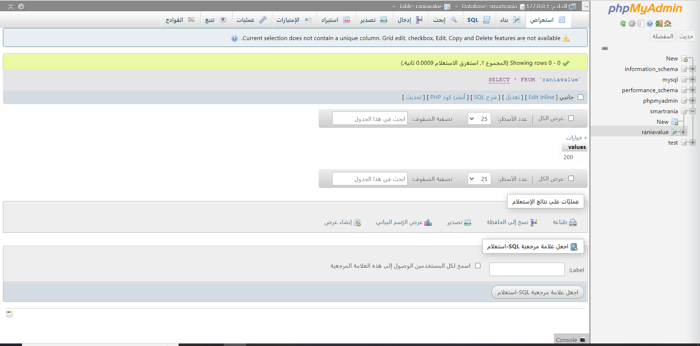
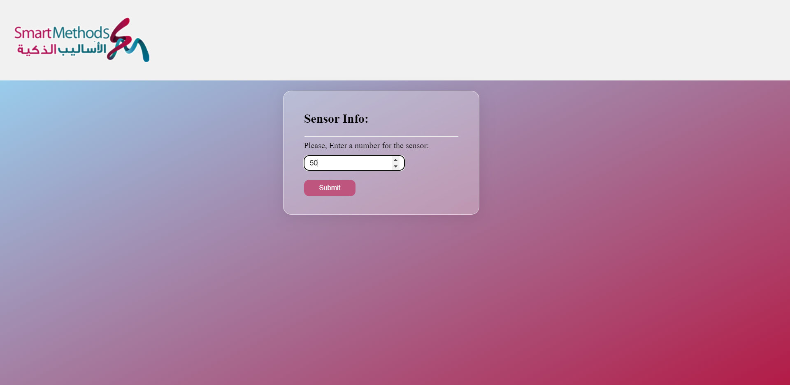

# Get-Method

Task 3 with Smart Methods:
A web application that takes integer from the sensor and send it to a database.

## 🛠 Tools

- HTML
- CSS
- JavaScript
- PHP
- MYSQL

## ⭐ Screenshots
- First step:

- Second step:

- Third step:

- Forth step:

